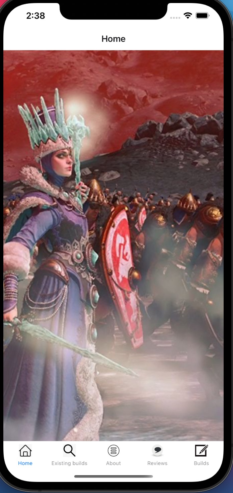
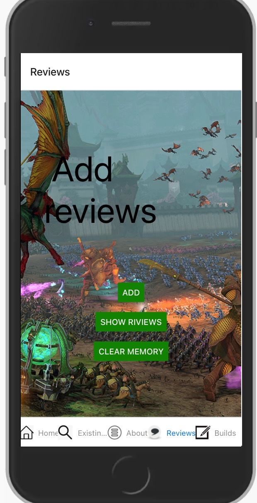
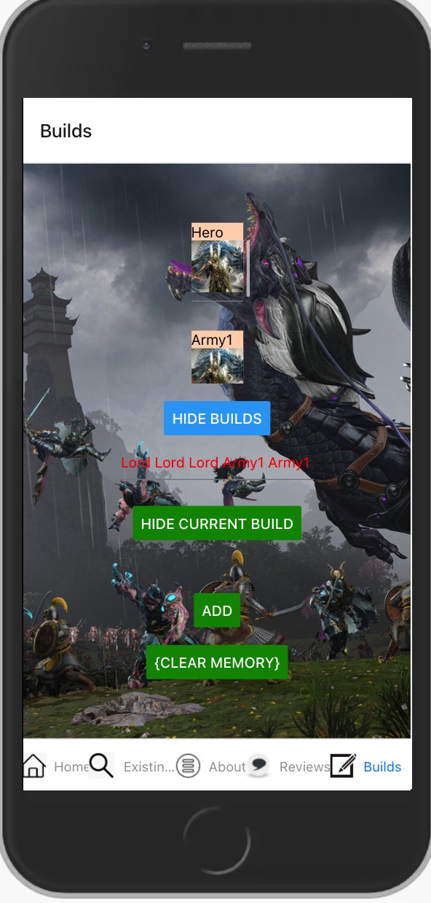
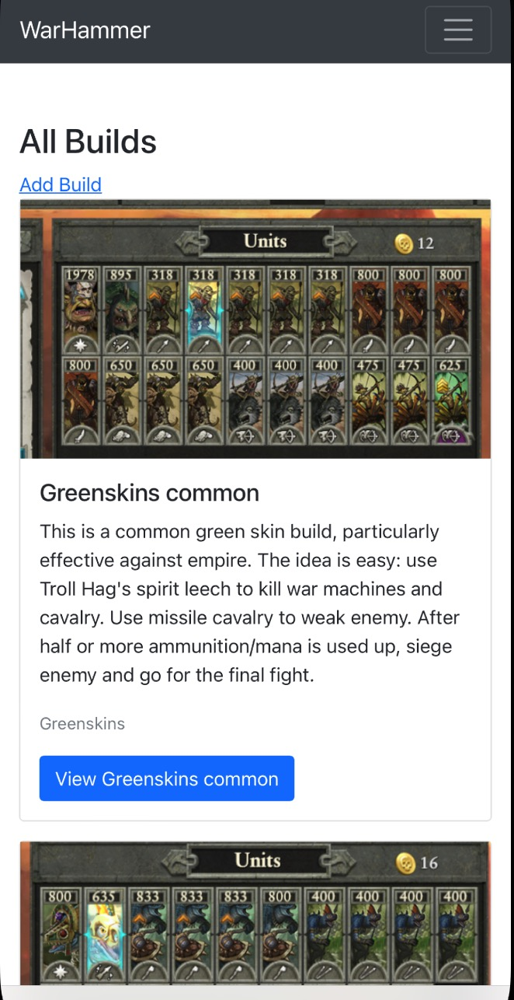

# mobile_app

Warhammer community
Lingyu Liu
lingyuliu@brandeis.edu

Elevator Pitch: 
This is an app about sharing information about totalwar warhammer game. It provides a platform for players to share their experiences and hopefully collect news for the coming game that would be published early next year. Users can view existing builds, add comments and make their own army builds.

GitHub:
https://github.com/LingyuLiu11/mobile_app

Movie:
https://brandeis.zoom.us/rec/share/deCk2-U_HDe7hJDhr6ST3Mgg0XueJUIIK1wvwVa3izyLfuyBhSPMfKYEv3TSFGvg.mqP8Ll86SvI8UfHU?startTime=1639354075000

Techniques used: React, bootstrap, async storage, mongodb etc.
